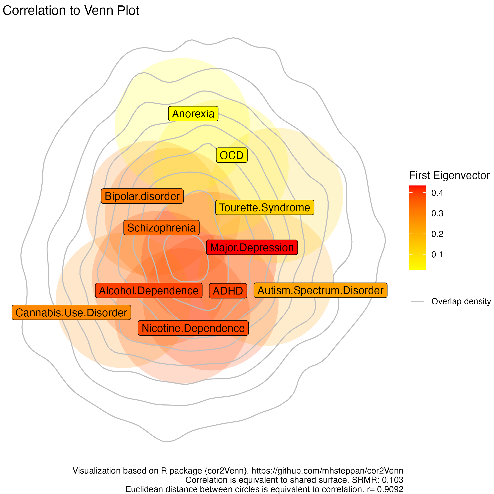
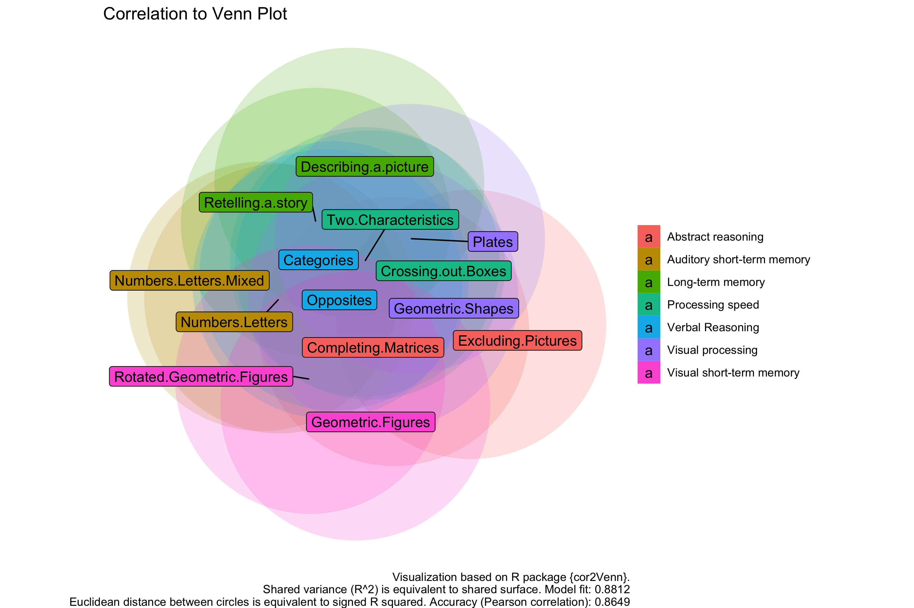

# cor2Venn

This package visualizes a correlation matrix as a Venn diagram. The overlap of circles represents the shared variance (R squared) between variables. Using additional features (e.g. cor2dist) the distance between variables is proportionate to their correlation (close = positive correlation; distant = negative correlation). The problem is optimized using Quasi-Newton optimization. Computation time increases exponentially the more variables are included. 

## Installation

```R 
library(devtools)
install_github("mhsteppan/cor2Venn")
library(cor2Venn)
```


## Examples


### Example on the "Sexual Compulsivity Scale"

Openpsychometrics.org provides a dataset on N=3,376 answers to the Sexual Compulsivity Scale from Kalichman and Rompa (1995). 

```R 
c<-cor(dd[,1:10])


fitSCS<-cor2Venn(c,cor2dist=F)

lbls<-c("My sexual appetite has gotten\n in the way of my relationships","My sexual thoughts and behaviors\n are causing problems in my life","My desires to have sex \nhave disrupted my daily life","I sometimes fail to meet \nmy commitments and responsibilities \nbecause of my sexual behaviors",
        "I sometimes get so horny\nI could lose control","I find myself thinking \nabout sex while at work","I feel that sexual thoughts and feelings \nare stronger than I am","I have to struggle to control \nmy sexual thoughts and behavior","I think about sex \nmore than I would like to",
        "It has been difficult for me \nto find sex partners who desire \nhaving sex as much as I want to.")


p<-cor2Vennplot(fitSCS,manualnodelabels = lbls,density = T)
p<-p+scale_fill_gradient(high="red",low="orange")

```


### Example on the Big Five

Openpsychometrics.org published a dataset on N=19,719 individuals responding to a Big Five questionnaire. The raw data is used here. First the correlation matrix is calculated, then the visualization is fitted to the correlation matrix. Due to the fact that some items are inversely coded, the parameter Recode = TRUE is used, so that the highest correlation is always positive. (Attention: This example runs for several minutes)

```R 
cormat<- cor(big5,use="pairwise.complete.obs")

### The fitting of this model is computationally heavy due to the high number of variables. Therefore, a prefitted model is available which can be used as starting values

## fitbig5 <- cor2Venn(cormat,Recode=TRUE)
## You can save a cor2Venn object and then use the startingvalues ()
## saveRDS(fitbig5,file="prefittedmodelbig5.RData")

prefittedmodel <- readRDS("prefittedmodelbig5.RData")

fitbig5 <- cor2Venn(cormat,Recode=TRUE,cor2dist=T,startingvalues = prefittedmodel)

p<-cor2Vennplot(fitbig5,manualalphafill=0.2,fillmode="mclust",density = T)
p<-p+scale_fill_discrete(labels=c("Extraversion","Neuroticism","Agreeableness","Conscientiousness","Openness"))
p

```


### Example on genetic correlations across psychiatric disorders - the p' factor 

Abdellaoui et al. published genetic correlations across psychiatric disorders including substance use disorders. Genetic correlations represent the proportion of variance that two traits share due to genetic causes. Therefore, for visualization purposes we use squared = FALSE. 

```R 
cormat<- abdellaouietal
fitrg <- cor2Venn(cormat, Rsquared=F,cor2dist=T)
p<-cor2Vennplot(fitrg,manualalphafill=0.2,density=T)
p<-p+scale_fill_gradient(high="red",low="yellow")
p
ggsave(p,file="abdellaouicor2venn.png")

```



Source: Abdellaoui, A., Smit, D. J., van den Brink, W., Denys, D., & Verweij, K. J. (2021). Genomic relationships across psychiatric disorders including substance use disorders. Drug and alcohol dependence, 220, 108535.

### Example on the g' factor of intelligence

This is an example on 14 subtests of the intelligence and development test (IDS-2). The visualization shows a 'positive manifold', i.e. that all subtests share variance with each other. Some subtests (e.g. reasoning) are more central than others (e.g. memory).  

```R 
cormat<-ids2cormat
fit<-cor2Venn(ids2cormat)


mode<-c("Verbal Reasoning","Verbal Reasoning","Long-term memory","Long-term memory","Visual short-term memory","Visual short-term memory","Auditory short-term memory","Auditory short-term memory","Processing speed","Processing speed","Visual processing","Visual processing","Abstract reasoning","Abstract reasoning")

p<-cor2Vennplot(fit,manualfill=mode,manualalphafill = 0.2,labelfill=mode)
p
ggsave(p,file="ids2cor2venn.png")

```





## How to cite 

Steppan, M. (2022). cor2Venn: visualizing correlation matrices as Venn diagrams. R package version 0.0.1

